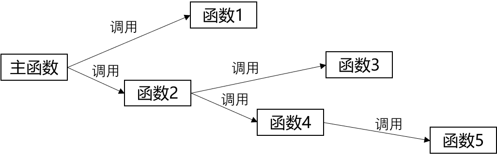

# 结构化程序设计与面向对象程序设计

##一. 结构化程序设计

###1)  结构化程序设计简介

结构化程序设计方法主张按照功能来分析系统需求，其主要原则是自顶向下、逐步求精、模块化等。结构化程序设计首先采用结构化分析(Structured Analysis,SA)方法对系统进行需求分析，然后使用结构化设计(Structured Design,SD)方法对系统进行概要设计、详细设计，最后采用结构化编程（Structured Program，SP)方法来实现系统。

结构化设计设计方法因主张按功能模块对软件系统进行划分也叫面向功能程序设计方法。在结构化设计方法中，每个功能都对数据进行一次处理，每个功能都接受一些数据，这些数据可以是函数形参、全局变量、和常量等，处理完后输出一些数据，输出数据可以是函数返回值以及一些传出参数等。这种对数据处理的方式也被称为面向数据流的处理方式。

在结构化程序设计中，函数是程序的最小处理单元，每个函数都负责完成一个功能，用以接受一些输入数据，函数对这些输入数据进行处理，处理结束后输出一些数据。整个软件系统由一个个的函数组成，其中作为程序入口的函数被称为主函数，主函数依次调用其他普通函数，普通函数之间依次调用，从而完成整个软件系统的功能。其逻辑结构示意图如下：

结构化程序设计的优点：采用自顶向下、逐步求精、模块化的设计方法，能较好的保证系统开发的进度和质量。

结构化程序设计的缺点：其一是适应性差。也是因为采用自顶向下、逐步求精、模块化的设计方法，当需求发生改变时，需求所在的层次越高，系统代码改动量越大，维护成本较高；其二是设计不够直观，不符合人的思维习惯。

###2) 结构化程序设计的三种基本结构

1996年计算机科学家Bohm和Jacopini证明了这样的事实：任何简单或复杂的算法都可以由顺序结构、选择结构和循环结构这三种基本结构组合而成。

1. 顺序结构

   顺序结构表示程序中的各种操作是按照它们在程序中出现的先后顺序依次执行的。

   顺序结构流程图如下:

   

   顺序结构程序的执行流程为从a入口开始执行，按照顺序依次执行其中的S1和S2等操作，这里的S1、S2可以是一个非转移操作或多个非转移操作，甚至可以是一个空操作，也可以是3种基本结构中的任意一结构。程序执行完所有的操作后到出口b结束。

2. 选择结构

   选择结构表示程序的处理需要根据某个条件选择其中的一个分支执行。

   **单选择结构**：程序从入口a处开始执行，只有满足条件时才会执行一定的操作，不满足条件时则不进行任何操作，最终会在出口b处结束程序执行。其流程示意图如下：

   

   **双选择结构：**程序从入口a处开始执行，满足条件时执行满足条件的操作，不满足条件时执行不满足条件的操作，二者只能选择其一执行，最终程序会在出口b处结束。其流程示意图如下：

   

   **多选择结构：**程序从入口a处开始执行，满足条件时1时执行S1,否则进行条件2的判断，满足条件2时执行S2操作，否则进行条件3判断，满足条件3时执行S3操作，依此类推。其流程示意图如下：

   

   需要注意的是条件之间的关系:程序越往后执行，需要满足的条件就会越苛刻，其条件范围也会越来越小。例如学生考试成绩以优(90分以上)、良(80-90)、中(60-80)、差(小于60)，则条件判断应该优先判断学生分数是否小于60（差），否则再判断是否成绩在区间60-80(中)，若还不在60-80区间则继续判断是否在80-90(良)，若还不在80-90区间则判断为大于90(优)。越往后执行判断，需要满足的条件越苛刻，其条件范围越小。

3. 循环结构

   循环结构表示程序反复执行某个或某些操作，直到循环条件为假(或为真)时才停止循环。循环结构分为两种：当型循环与直到型循环。

   **当型循环：**先判断循环条件，当条件为真时执行循环体(复执行的某个或某些操作),并且在循环体结束时返回到循环入口处，再次判断循环条件，如果条件为假，则退出循环体，结束循环。其流程示意图如下：

   

   **直到型循环：**从入口处直接执行循环体，循环体执行结束时判断条件，如果条件为真，则返回入口处继续执行循环体，直到条件为假时退出执行循环体到达流程出口处。其流程示意图如下：

   

   两种循环结构的区别：当型循环是先判断条件，在执行循环体，直到型循环是先执行循环体，在进行循环条件判断。直到型循环不管循环条件是否满足，循环体总会被执行一次。

二. 面向对象程序设计

1）面向对象程序设计简介

面向对象程序设计的基本思想是使用类、对象、继承、封装、消息等基本概念进行程序设计。它从现实世界中客观存在的事物(对象)出发来构造软件系统，并在软件系统构造中尽可能运用人类的自然思维方式，强调直接以现实世界中的事物(对象)为中心来思考，认识问题，并根据这些事物的本质特点，把它们抽象地表示为软件系统中的类，作为系统的基本构成单元，这使得软件系统的组件可以直接映像到客观世界，并保持客观世界中事物及其相互关系的本来面貌。

采用面向对象程序设计开发的软件系统，其最小的程序单元是类，这些类可以生成系统中的多个对象，对象之间的互相合作调用完成软件系统所需要的功能需求，这些对象可以直接映像成与客观世界中存在的各种事物。采用面向对象程序设计开发的软件系统的逻辑组成结构如下：

